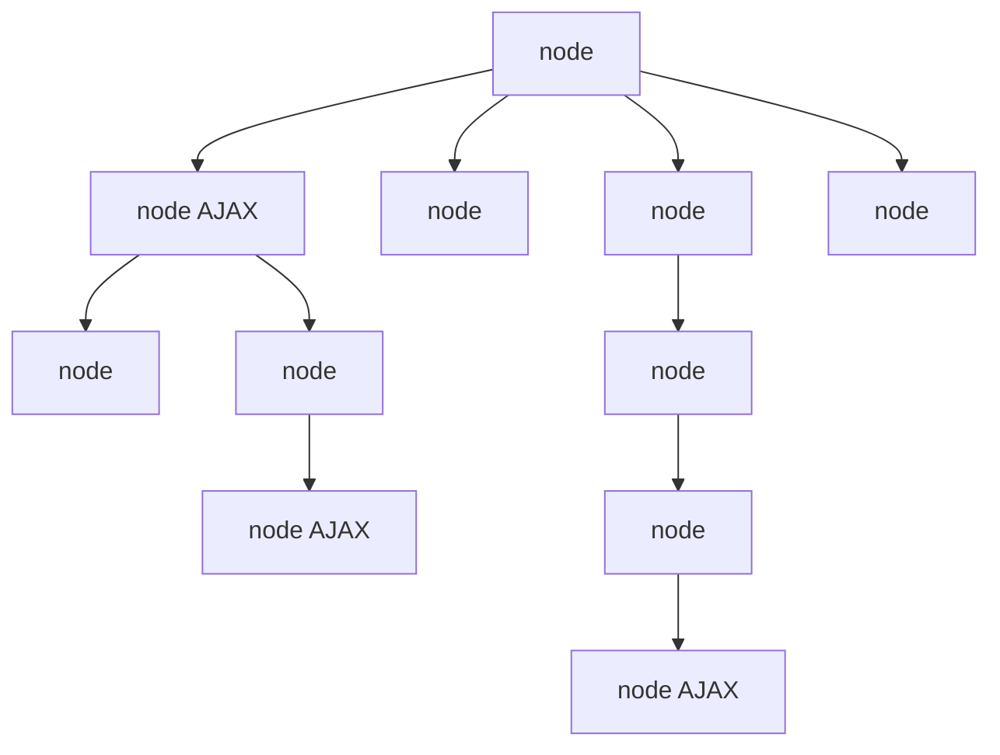

---
# try also 'default' to start simple
theme: seriph
# random image from a curated Unsplash collection by Anthony
# like them? see https://unsplash.com/collections/94734566/slidev
background: https://source.unsplash.com/collection/94734566/1920x1080
# apply any windi css classes to the current slide
class: "text-center"
# https://sli.dev/custom/highlighters.html
highlighter: shiki
# show line numbers in code blocks
lineNumbers: false
# some information about the slides, markdown enabled
info: |
  ## Slidev Starter Template
  Presentation slides for developers.

  Learn more at [Sli.dev](https://sli.dev)
# persist drawings in exports and build
drawings:
  persist: false
# page transition
transition: slide-left
# use UnoCSS
css: unocss
---

# 关于 React 中的函数式编程

消除副作用？、useSWR？、useRequest？...

<!--
The last comment block of each slide will be treated as slide notes. It will be visible and editable in Presenter Mode along with the slide. [Read more in the docs](https://sli.dev/guide/syntax.html#notes)
-->

---

## transition: fade-out

---

# 问题？

假如当你遇到封装一个获取 localStorage 的方法的时候，应该怎么写？

是封装一个工具函数？

```tsx {all|2}
function App() {
  const { value, setValue } = getLocalStorage("key");
  return <div>{value}</div>;
}
```

还是封装一个自定义 hooks？

```tsx {all|2}
function App() {
  const { value, setValue } = useLocalStorage("key");
  return <div>{value}</div>;
}
```

它们之间有什么区别？

<style>
h1 {
  background-color: #2B90B6;
  background-image: linear-gradient(45deg, #4EC5D4 10%, #146b8c 20%);
  background-size: 100%;
  -webkit-background-clip: text;
  -moz-background-clip: text;
  -webkit-text-fill-color: transparent;
  -moz-text-fill-color: transparent;
}
</style>

---

layout: image-right
image: https://source.unsplash.com/collection/94734566/1920x1080

---

# 函数式编程的核心思想

<br>

$f(x) = y$

<div v-click="1">

$f(props) = vdom$

</div>

<div v-click="2">

```jsx {all}
function App(props) {
  return <div>{props.name}</div>;
}
```

</div>

<div v-click="3">

$f(props + state) = vdom$

</div>

<div v-click="4">

```jsx {all}
function App(props) {
  const [state] = useState();
  return (
    <div>
      {props.name} | {state}
    </div>
  );
}
```

</div>

---

layout: image-right
image: https://source.unsplash.com/collection/94734566/1920x1080

---

# 函数式编程的核心思想

<div>

$f(props + state + storage) = vdom$

</div>

<div v-click="1">

```jsx {all}
function App(props) {
  const store = useSelector();
  const [state] = useState();
  return (
    <div>
      {props.name} | {state} | {store}
    </div>
  );
}
```

</div>

<div v-click="2">

$f(props + state + localstorage) = vdom$

</div>

<div v-click="3">

```jsx {all}
function App(props) {
  const storage = useLocalStorage();
  const [state] = useState();
  return (
    <div>
      {props.name} | {state} | {storage}
    </div>
  );
}
```

</div>

<br>

---

# 函数式编程的核心思想

<div class="text-4xl text-center mt-43 text-red-500">

把 localstorage 变成一个可靠的输入，而不是副作用

</div>

---

# useSyncExternalStore

[**useSyncExternalStore**](https://beta.reactjs.org/reference/react/useSyncExternalStore#subscribing-to-a-browser-api) is a React Hook that lets you subscribe to an external store.

```ts {all}
import { useSyncExternalStore } from "react";

export default function ChatIndicator() {
  // 订阅网络状态，该hooks接收两个方法，subscribe与getSnapshot，返回网络状态，并且在isOnline变化时，触发React应用更新
  const isOnline = useSyncExternalStore(subscribe, getSnapshot);

  // 业务代码只管拿到isOnline做视图渲染。不需要考虑任何的副作用
  return <h1>{isOnline ? "✅ Online" : "❌ Disconnected"}</h1>;
}
// getSnapshot方法只需要返回当前的状态，此处需要返回当前的网络状态
function getSnapshot() {
  return navigator.onLine;
}
// subscribe方法用于订阅状态变化的时机。当时机变化后调用callback，getSnapshot方法就会执行，返回最新的状态。此处需要订阅网络变化的时机：online、offline
function subscribe(callback) {
  window.addEventListener("online", callback);
  window.addEventListener("offline", callback);
  return () => {
    window.removeEventListener("online", callback);
    window.removeEventListener("offline", callback);
  };
}
```

<p class="text-right">

[Learn More](https://beta.reactjs.org/reference/react/useSyncExternalStore)

</p>

<style>
.footnotes-sep {
  @apply opacity-10;
}
.footnotes {
  @apply text-sm opacity-75;
}
.footnote-backref {
  display: none;
}
</style>

---

## class: px-20

---

# useSyncExternalStore 改造 useLocalStorage

```ts {all|1,13|4,5,7|4,5,7,11}
import { useSyncExternalStore } from "react";

export default function useLocalStorage(key: string) {
  const subscriber = (callback: any) => {
    window.addEventListener("storage", callback);
    return () => {
      window.removeEventListener("storage", callback);
    };
  };

  const getSnapshot = () => window.localStorage.getItem(key);

  const value = useSyncExternalStore(subscriber, getSnapshot);

  const setValue = (value: string) => {
    window.localStorage.setItem(key, value);
  };

  return { value, setValue };
}
```

---

# useSelector 的实现

```ts {all|1,10}
import { useSyncExternalStoreWithSelector } from "use-sync-external-store/shim/with-selector";

function useSelector<TState, Selected extends unknown>(
  selector: (state: TState) => Selected,
  equalityFn: EqualityFn<NoInfer<Selected>> = refEquality
): Selected {
  const { store, subscription, getServerState } = useReduxContext()!;

  const selectedState = useSyncExternalStoreWithSelector(
    subscription.addNestedSub,
    store.getState,
    getServerState || store.getState,
    selector,
    equalityFn
  );

  return selectedState;
}
```

<p class="text-right">

[redux 源码](https://github.com/reduxjs/react-redux/blob/8d03182d36abe91cb0cc883478f3b0c2d7f9e17f/src/hooks/useSelector.ts#L33)

[use-sync-external-store npm](https://www.npmjs.com/package/use-sync-external-store)

</p>

---

# useSWR

<div class="nx-w-full nx-min-w-0 nx-leading-7"><p class="nx-mt-6 nx-leading-7 first:nx-mt-0">✅使用 SWR，组件将会<strong>不断地</strong>、<strong>自动</strong>获得最新数据流。<br>
UI 也会一直保持<strong>快速响应</strong>。</p></div>

<div v-click="1">

```tsx {all}
function App() {
  const [state] = useState();
  return <div>{state}</div>;
}
```

</div>

<div v-click="2">

```tsx {all}
function App() {
  const [state] = useRemoteState();
  return <div>{state}</div>;
}
```

</div>

<div v-click="3">

```tsx {all}
import useSWR from "swr";

function fetcher(path: string) {
  return fetch(`http://localhost:4000${path}`).then((res) => res.json());
}

function App() {
  const { data, error, isLoading } = useSWR("/url", fetcher);
  return <div>{data}</div>;
}
```

</div>

---

# useSWR 不仅仅是一个接口请求库

我们可以用 useSWR 来解决这些日常头疼的问题：

1. 封装请求

传统形式

```jsx
function App() {
  const [data, setData] = useState();
  const [loading, setLoading] = useState();
  const [err, setErr] = useState();

  useEffect(() => {
    if (loading) return;
    setLoading(true);
    fetcher()
      .then((res) => {
        setData(res);
      })
      .catch((err) => {
        setErr(err);
      })
      .finally(() => {
        setLoading(false);
      });
  }, []);
}
```

---

# useSWR 不仅仅是一个接口请求库

我们可以用 useSWR 来解决这些日常头疼的问题：

有了 useSWR，只需一行

```jsx
function App() {
  const { data, isLoading, error } = useSWR("key", fetcher);
}
```

对于分页的操作：

```jsx

const { data, error, isLoading, isValidating, mutate, size, setSize } = useSWRInfinite(
  getKey, fetcher?, options?
)

```

---

# useSWR 不仅仅是一个接口请求库

我们可以用 useSWR 来解决这些日常头疼的问题：

2. 缓存！



这种情况下怎么写？useSWR 随便写，自动我们处理好了所有事情

---

# SWR 的概念

<p class="nx-mt-6 nx-leading-7 first:nx-mt-0">“SWR” 这个名字来自于 <code class="nx-border-black nx-border-opacity-[0.04] nx-bg-opacity-[0.03] nx-bg-black nx-break-words nx-rounded-md nx-border nx-py-0.5 nx-px-[.25em] nx-text-[.9em] dark:nx-border-white/10 dark:nx-bg-white/10  " dir="ltr">stale-while-revalidate</code>：一种由 <a href="https://tools.ietf.org/html/rfc5861" target="_blank" rel="noreferrer" class="nx-text-primary-600 nx-underline nx-decoration-from-font [text-underline-position:from-font]">HTTP RFC 5861<span class="nx-sr-only"> </span></a> 推广的 HTTP 缓存失效策略。这种策略首先从缓存中返回数据（过期的），同时发送 fetch 请求（重新验证），最后得到最新数据。</p>

```jsx
// key可以是字符串
useSWR("/api/user", (url) => fetcher(url));

// 可以传递数组的方式传递多个参数
useSWR(["/api/user", token], ([url, token]) => fetchWithToken(url, token));

// 传递null的方式阻止请求接口
useSWR(user ? ["/api/orders", user] : null, fetchWithUser);

// 也可以传递对象
useSWR({ url: "/api/orders", args: user }, fetcher);
```

只要 key 发生变化，就当做是请求新的数据，那么会是一份新的数据（缓存）

换个角度说，只要应用中任何地方的 useSWR key 相同，那么将能拿到一样的数据（缓存）

---

# SWR 的概念

```jsx {all|4,7,16,17,22}
const cached = useSyncExternalStore(
  useCallback(
    (callback: () => void) =>
      subscribeCache(
        key,
        (current: State<Data, any>, prev: State<Data, any>) => {
          if (!isEqual(prev, current)) callback();
        }
      ),
    [cache, key]
  ),
  getSnapshot[0],
  getSnapshot[1]
);

const getSnapshot = useMemo(() => {
  const shouldStartRequest = (() => {
    ///
  })();
  const snapshot = mergeObjects(state);
  if (!shouldStartRequest) {
    return snapshot;
  }
});
```

---

layout: image-right
image: https://source.unsplash.com/collection/94734566/1920x1080

---

# useSWR 还有很多不可思议的功能

<br>
<br>

- [自动重新请求](https://swr.bootcss.com/docs/revalidation)：自动重新请求，窗口获得焦点、网络重新连接时重新请求，可以使得应用及时获得最新数据。及时更新状态。
- [自动错误重试](https://swr.bootcss.com/docs/error-handling#%E9%94%99%E8%AF%AF%E9%87%8D%E8%AF%95)：自动错误重试，不用处理错误
- [乐观更新](https://swr.bootcss.com/docs/mutation#%E4%B9%90%E8%A7%82%E6%9B%B4%E6%96%B0)：可以在发起更新请求时，乐观的直接更新本地数据。减少等待时间。
- [条件请求](https://swr.bootcss.com/docs/conditional-fetching)：可以很智能的链式依赖的条件请求数据，捕获 promise 错误

<v-click>

都是为了能够把副作用数据变为可靠的输入

</v-click>

---

# useSWR 好，但也不是万能的

1. 普通的 post，意义不大

2. 灵活度不高，可以用 ahooks 的 useRequest，一个不错的 useSWR 平替

3. 有一些 bug

---

# ahooks 的 useRequst，一个半自动的 useSWR

[https://ahooks.js.org/zh-CN/hooks/use-request/index](https://ahooks.js.org/zh-CN/hooks/use-request/index)

useRequest 是一个强大的异步数据管理的 Hooks，React 项目中的网络请求场景使用 useRequest 就够了。

useRequest 通过插件式组织代码，核心代码极其简单，并且可以很方便的扩展出更高级的功能。目前已有能力包括：

- 自动请求/手动请求
- 轮询
- 防抖
- 节流
- 屏幕聚焦重新请求
- 错误重试
- loading delay
- SWR(stale-while-revalidate)
- 缓存

---

layout: image-left
image: https://source.unsplash.com/collection/94734566/1920x1080

---

# React 函数式组件的原则

1. React 中的函数式编程，就是一个提取副作用的过程。尽可能的不要在业务代码中使用 useEffect，减少业务代码里面的副作用，如果有，最好提出去，封装成自定义 hooks，保证业务代码的纯函数特性
2. 尽可能的少用 props 传递数据，而是利用 hooks 热插拔的特性注入数据
3. 尽可能的少定义内部状态，最好是一个状态定义整个组件的表现。多个状态容易出现冲突的问题。

---

layout: image-left
image: https://source.unsplash.com/collection/94734566/1920x1080

---

# One More Thing...

<div class="text-2xl mt-15 text-red-500">

localstorage 的监听回调不能在当前页面触发...

</div>

<div class="mt-12">

我看过的所有的第三方 hooks 库都没有利用 addEventListener(\'storage\')来监听回调。。。也许是因为没有使用场景。

所以前面提到的 useLocalStorage 只是假设，有可能不会在实际上使用。

当然，我个人觉得加上 addEventListener(\'storage\')才是完成体 useLocalStorage，错的是第三方库。。。

</div>
